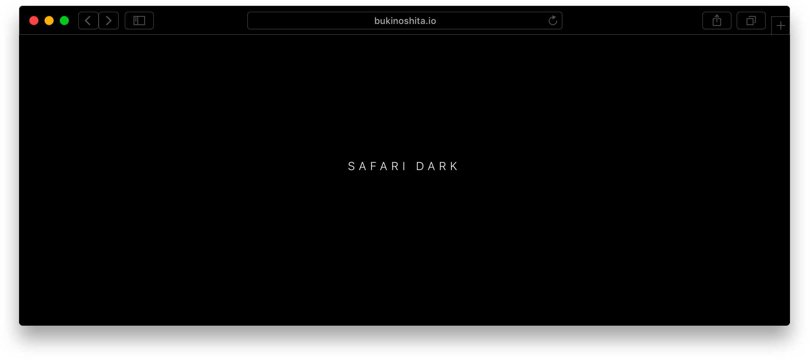
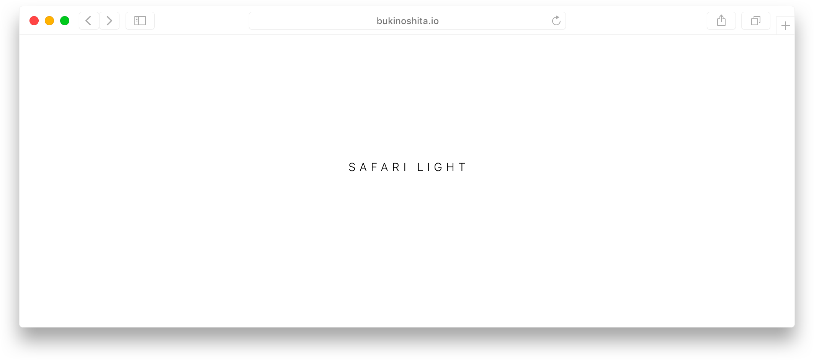

# Safari

> Safari Dark/Light theme for Sketch

## Dark

## Light

## Usage

* Clone the repository `$ git glone https://github.com/bukinoshita/safari.git`
* Install the dependencies `$ yarn`
* Run `$ yarn pull` to transform the `json` files to `sketch`

_It uses [sketch-json](https://github.com/bukinoshita/sketch-json-cli) to transform sketch files to json and json to sketch files and also for versioning the design._

## License

MIT © [Bu Kinoshita](https://bukinoshita.io)
